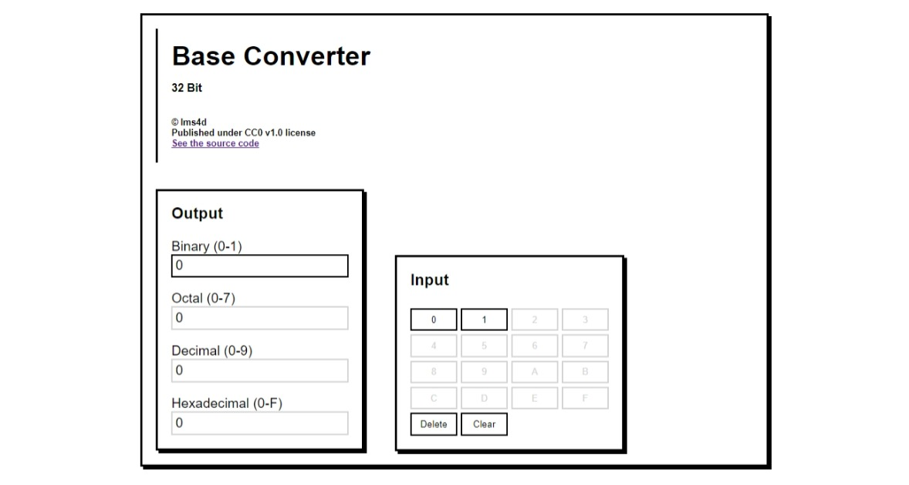

# PABCL2024
Ini merupakan repository yang menyimpan projek web yang ditujukan untuk submission penerimaan anggota baru CodeLabs tahun 2024
## Deskripsi
Repository ini merupakan web base converter yang mana bisa melakukan konversi terhadap beberapa jenis bilangan yang terdapat pada sistem komputer: biner, oktal, desimal, dan hexadesimal
untuk penggunaannya tinggal klik pada bagian output, lalu masukkan angka dengan mengklik tombol pada bagian input. Beberapa tombol input akan otomatis nonaktif ketika pengguna mengubah opsi output, dan konversi dilakukan secara realtime saat pengguna mengubah input

Demo: <https://ims4d.github.io/PABCL2024/>
## Tech
1. HTML
2. CSS
3. JavaScript
